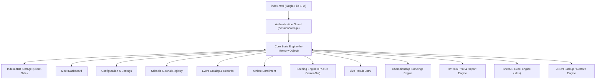

# 🌊 AquaFlow / Athlete Prime | Swimming & Athletics Meet Management System

[](Swimming-Meet-Management-Application--AquaFlow--main/index.html)
[](Swimming-Meet-Management-Application--AquaFlow--main/index.html)
[](Swimming-Meet-Management-Application--AquaFlow--main/index.html)
[](README.md)

**AquaFlow** (also featuring **Athlete Prime**) is an all-in-one, high-performance, single-file web application built for the organization and administration of competitive **Swimming**, **Athletics (Track & Field)**, and **Combined Multi-Sport Meets**. 

Engineered with zero backend dependencies, AquaFlow runs directly inside any modern web browser while providing enterprise-grade meet management: automatic HY-TEK center-out lane seeding, multi-sheet Excel synchronization, offline-first IndexedDB persistence, live record tracking, age group champion calculations, and publication-ready official reports.

---

## 📋 Table of Contents

- [Key Highlights](#-key-highlights)
- [System Architecture](#-system-architecture)
- [Credentials & Security](#-credentials--security)
- [Feature Walkthrough](#-feature-walkthrough)
  - [1. Real-Time Meet Dashboard](#1-real-time-meet-dashboard)
  - [2. Meet Configuration & Rules](#2-meet-configuration--rules)
  - [3. Schools & Zonal Registry](#3-schools--zonal-registry)
  - [4. Event Catalog & Record Management](#4-event-catalog--record-management)
  - [5. Athlete Registration & Profile Management](#5-athlete-registration--profile-management)
  - [6. Intelligent Seeding Engine](#6-intelligent-seeding-engine)
  - [7. Fast Result Entry & Live Timing](#7-fast-result-entry--live-timing)
  - [8. Scoring & Standings Ecosystem](#8-scoring--standings-ecosystem)
  - [9. Official Print-Ready HY-TEK Reports](#9-official-print-ready-hy-tek-reports)
  - [10. Spreadsheet (Excel) & JSON Backup Integration](#10-spreadsheet-excel--json-backup-integration)
- [Data Models & Schemas](#-data-models--schemas)
- [Seeding & Scoring Algorithms](#-seeding--scoring-algorithms)
- [Quick Start Guide](#-quick-start-guide)
- [Print & Reporting Guidelines](#-print--reporting-guidelines)
- [Technical Stack](#-technical-stack)
- [License](#-license)

---

## ⚡ Key Highlights

- **Single-File Portability**: The entire system lives inside a standalone HTML document ([index.html](Swimming-Meet-Management-Application--AquaFlow--main/index.html)). Simply copy or double-click to run anywhere—no Node.js server, Python environment, Docker containers, or database installations required.
- **Offline-First Storage**: Uses browser **IndexedDB** (`AthletePrimeDB` / `AquaFlowDB`) to store all state locally with automatic database schema upgrades, instant autosave, and zero network requirement.
- **Multi-Sport Engine**: Native support for:
  - **Swimming Meets** (Freestyle, Backstroke, Breaststroke, Butterfly, Individual Medley, Relays).
  - **Track Events** (60m, 100m, 200m, 400m, 800m, 1500m, Hurdles, Relays, Marathons).
  - **Field Events** (High Jump, Long Jump, Triple Jump, Pole Vault, Shot Put, Discus, Javelin, Hammer Throw).
  - **Combined Meets** (Simultaneous swimming and track & field operations).
- **HY-TEK Style Lane Seeding**: Fast center-out lane assignments for both 6-lane and 8-lane configurations (`[4, 5, 3, 6, 2, 7, 1, 8]` or `[3, 4, 2, 5, 1, 6]`).
- **Flexible Terminology**: Seamlessly toggle between **School** and **House** classifications for inter-school, zonal, district, or internal sports days.
- **Record Tracking & Broken Record Detection**: Preload Meet, Provincial, and National School Records. The system automatically detects and flags new records (`MR`, `PR`, `NR`) during live result entry.
- **Official Government & Ministry Reports**: Generates detailed **Official Merit Lists** containing national identity numbers, birth certificate references, student admission numbers, and full placings for certificate generation.
- **Full Excel Import/Export**: Built-in [SheetJS](https://sheetjs.com/) engine with intelligent header auto-detection, capable of parsing bulk athlete enrollments and exporting complete meet databases.

---

## 🏛️ System Architecture



---

## 🔐 Credentials & Security

AquaFlow includes a secure administrative sign-in portal on launch.

| Parameter | Default Value | Notes |
|:---|:---|:---|
| **Default Username** | `admin` | Editable in **Main Settings** |
| **Default Password** | `aqua@2026` | Editable in **Main Settings** |
| **Session Key** | `aquaflow_auth` | Stored in browser `sessionStorage` |
| **Security Note** | Client-Side Admin Auth | Protects against accidental meet modifications during scoring |

> [!TIP]
> You can update the administrator username and password at any time by navigating to **Main Settings** &rarr; **System Security** and clicking **Save Configuration**.

---

## 🌟 Feature Walkthrough

### 1. Real-Time Meet Dashboard
- **Key Metrics**: Real-time counter cards showing **Total Swimmers/Athletes**, **Schools/Clubs Registered**, and **Active Events**.
- **Live Participation Matrix**: Tabular summary of participating schools, their zonal affiliation, and breakdown of enrolled boys, girls, and total athletes.
- **Real-Time Clock & Header**: Displays current active meet name, date, and local system time.

### 2. Meet Configuration & Rules
- **General Meet Parameters**:
  - **Meet Name**: Official title (e.g., *National Schools Games 2026*).
  - **Date Range**: Multi-day scheduling format (e.g., `2026/03/21 - 2026/03/24`).
  - **Location / Venue**: Host stadium or aquatic complex.
  - **Number of Lanes**: Toggle between **6 Lanes** and **8 Lanes**.
  - **Meet Type**: Select between **Swimming Meet**, **Athletics Meet (Track & Field)**, or **Combined (Swimming + Athletics)**.
  - **Team Classification Label**: Choose between `School` or `House`.
- **Championship Points System**:
  - **Individual Events (Places 1–8)**: Default `10, 7, 5, 4, 3, 2, 1, 0`.
  - **Relay Events (Places 1–8)**: Default `20, 14, 10, 8, 6, 4, 2, 0`.
  - **Marathon Team Bonus Points (Places 1–4)**: Default `20, 15, 10, 5`.

### 3. Schools & Zonal Registry
- Register participating schools, clubs, or houses with their corresponding **Zonal / Regional Division**.
- Features an auto-complete `datalist` for rapid school entry.
- **Cascading Update**: Renaming an existing school propagates immediately across all registered athletes and historical results.

### 4. Event Catalog & Record Management
- **Event Definition**:
  - Event Number (sequential order).
  - Gender (`Boys` / `Girls`).
  - Age Group (`Under 12`, `Under 14`, `Under 16`, `Under 18`, `Under 20`, or custom).
  - Category (`Swimming`, `Track (Running)`, or `Field Event`).
  - Event Name (e.g., `50m Freestyle`, `100m Sprint`, `4x50m Medley Relay`, `High Jump`).
  - Type auto-detection (individual vs relay).
- **Three-Tier Historical Record Tracking**:
  - **Meet Record (MR)**: Time/Distance, Record Holder, Year.
  - **Provincial Record (PR)**: Time/Distance, Record Holder, Year, School, Zone.
  - **National Record (NR)**: Time/Distance, Record Holder, Year, School.
- **Printable Event Program**: One-click generation of the official schedule of events.

### 5. Athlete Registration & Profile Management
- **Complete Demographics**:
  - Full Name with automatic **Short Name formatting** (e.g. `Kasun Lakshitha Perera` &rarr; `K.L. Perera`).
  - Date of Birth (DOB) with automatic **Age Group calculation** (e.g., `2014/05/12` &rarr; `Under 14`).
  - Birth Certificate Number (`BC No`).
  - Academic Class and Student Admission Number (`Adm No`).
  - National Identity Card / Passport / Student ID (`ID No`).
  - Gender and School affiliation (automatically resolves the zonal territory).
- **Event Selection & Seed Formatting**:
  - Enrolls competitors into up to 3 individual events.
  - Dropdowns dynamically filter available events based on gender and age group, preventing duplicate event entries.
  - **Smart Seed Formatter**: Fast digit-entry formatting:
    - Typing `2580` auto-converts to `25.80`.
    - Typing `10245` auto-converts to `1:02.45`.
    - Typing `1152035` auto-converts to `1:15:20.35`.
- **Search-to-Edit**: Typing an existing athlete's name in the entry field automatically pulls up their entire profile for instant editing.

### 6. Intelligent Seeding Engine
- **HY-TEK Center-Out Lane Assignment**:
  - Distributes top-seeded athletes into the center lanes and lower-seeded athletes into the outer lanes.
  - **8 Lanes**: `4, 5, 3, 6, 2, 7, 1, 8`
  - **6 Lanes**: `3, 4, 2, 5, 1, 6`
- **Category-Aware Sorting**:
  - **Track & Swimming**: Ascending order (lowest time seeded first; unseeded `NT` competitors placed in early heats).
  - **Field Events**: Descending order (longest jump / highest mark seeded first).
- **Heat Sheets & Full Meet Program**:
  - View individual heat sheets per event.
  - Filter entry summaries by gender and age group.
  - One-click **Full Program (Book)** compiles the entire meet's heat sheets into a single printable document with page break controls.

### 7. Fast Result Entry & Live Timing
- Displays competitors pre-arranged in their exact heat and lane order.
- Supports keyboard navigation: pressing <kbd>Enter</kbd> saves the current lane time and shifts focus immediately to the next competitor.
- **Mode Toggle**:
  - **Final**: Awards official championship points to competitors and schools.
  - **Heat**: Records qualifying performance times without points.
- **Automatic Point Allocation**: Points are awarded strictly based on the configured points table for places 1 through 8.
- **Live Broken Record Badging**: Compares entered performances against existing Meet (`MR`), Provincial (`PR`), and National (`NR`) records, highlighting achievements instantly in bold red tags.

### 8. Scoring & Standings Ecosystem
- **Overall School Rankings**: Live leaderboard aggregating individual, relay, and marathon bonus points with separate totals for Boys, Girls, and Combined.
- **Individual Age Group Champions**: Isolates top 3 point scorers per age group and gender.
- **Relay Championship Standings**: Isolates relay race scores for specialized relay trophies.
- **Zonal Championship Standings**: Aggregates points across geographic school zones.
- **Marathon Scoring Engine**: 
  - Dynamic individual point formula: `Points = Total Participants - (Place - 1)`.
  - Automated team bonus points for the top 4 finishing institutions.

### 9. Official Print-Ready HY-TEK Reports
AquaFlow features custom `@media print` CSS style sheets formatted to standard international meet publication guidelines:
1. **Master Swimmer / Athlete List**: Comprehensive registry sorted by gender, age group, and name.
2. **Age Group Champions Report**: Official top 3 medalists and point holders.
3. **School Standings Report (Full)**: Complete breakdown with individual ranks, relay ranks, and grand totals.
4. **Relay-Only Standings**: Dedicated relay ranking sheet.
5. **Zonal Standings Report**: Regional team ranking sheet.
6. **Official Merit List**: Ministry-ready verification list with complete identification numbers (DOB, BC No, Admission No, ID No), schools, events, placings, and timings.
7. **Broken Records Summary**: Official record-breakers log listing event number, athlete name, school, time, and broken record tier (`MR`, `PR`, `NR`).
8. **Full Meet Results Book**: Generates all completed event result sheets in a single publication.

### 10. Spreadsheet (Excel) & JSON Backup Integration
- **Master Excel Download**: Exports a 4-tab workbook (`Schools`, `Events`, `Swimmers`, `Results`).
- **Fuzzy Header Import**: Upload existing spreadsheets directly. The parser automatically detects variations such as:
  - Names: `Competitor Name`, `Swimmer Name`, `Full Name`, `Student Name`, `Name`.
  - Schools: `School Name`, `College`, `Vidyalaya`, `Club`, `Team`, `Pasala`.
  - Events & Times: `Event 1`, `Seed Time 1`, `Ev1_No`, `Time1`.
- **System Backup & Restore (JSON)**: Creates a single uncompressed JSON file capturing 100% of the database state (settings, athletes, events, schools, records, and entered results).

---

## 📊 Data Models & Schemas

The entire state is maintained as a single structured object in IndexedDB:

```typescript
interface AquaFlowState {
  settings: {
    meetName: string;            // e.g. "National Schools Games 2026"
    meetDate?: string;           // e.g. "2026/03/21 - 2026/03/24"
    meetPlace?: string;          // e.g. "Sugathadasa Stadium Pool"
    lanes: 6 | 8;                // Available lane count
    meetType: 'swimming' | 'athletics' | 'combined';
    teamLabel: 'School' | 'House';
    points: {
      indiv: number[];           // [10, 7, 5, 4, 3, 2, 1, 0]
      relay: number[];           // [20, 14, 10, 8, 6, 4, 2, 0]
    };
    marathonBonus: number[];     // [20, 15, 10, 5]
    username: string;            // Admin username
    password: string;            // Admin password
  };

  schools: Array<{
    name: string;                // School / Club name
    zone: string;                // Zonal / Regional division
  }>;

  events: Array<{
    no: number;                  // Event sequence number
    gender: 'Boys' | 'Girls';
    age: string;                 // "Under 12", "Under 14", etc.
    category: 'swimming' | 'track' | 'field';
    name: string;                // "100m Free", "Long Jump", etc.
    type: 'indiv' | 'relay';
  }>;

  swimmers: Array<{
    id: number;                  // Unique timestamped identifier
    full: string;                // Full Name
    short: string;               // Short Name (e.g. "K.L. Perera")
    dob: string;                 // YYYY/MM/DD
    bcno: string;                // Birth Certificate Number
    class: string;               // Grade / Class
    admno: string;               // School Admission Number
    idno: string;                // National Identity / Student ID
    gender: 'Boys' | 'Girls';
    school: string;              // Linked to schools[].name
    age: string;                 // Age Category
    evs: Array<{
      no: number;                // Event number
      t: string;                 // Seed Time (MM:SS.ms) or Distance (m)
    }>;
  }>;

  results: {
    [eventNo: number]: {
      [swimmerId: string]: {
        t: string;               // Recorded Result
        pts: number;             // Awarded Points
      };
    };
  };

  records: {
    [eventNo: number]: {
      meet?: { t: string; holder: string; yr: string; school: string; zone?: string; };
      provincial?: { t: string; holder: string; yr: string; school: string; zone?: string; };
      national?: { t: string; holder: string; yr: string; school: string; zone?: string; };
    };
  };
}
```

---

## 🧮 Seeding & Scoring Algorithms

### Center-Out Lane Assignment Matrix

When an event is seeded, athletes are partitioned into heats. Within each heat, lanes are assigned center-out according to seed quality:

| Rank in Heat | 8-Lane Pool / Track | 6-Lane Pool / Track | Position |
|:---:|:---:|:---:|:---|
| **1st (Fastest / Best)** | **Lane 4** | **Lane 3** | Center Primary |
| **2nd** | **Lane 5** | **Lane 4** | Center Secondary |
| **3rd** | **Lane 3** | **Lane 2** | Center-Left |
| **4th** | **Lane 6** | **Lane 5** | Center-Right |
| **5th** | **Lane 2** | **Lane 1** | Outside-Left |
| **6th** | **Lane 7** | **Lane 6** | Outside-Right |
| **7th** | **Lane 1** | — | Far Outside-Left |
| **8th** | **Lane 8** | — | Far Outside-Right |

### Performance Evaluation Logic

```text
Timing Conversion:
    "01:23.45"  ==>  (1 * 60) + 23.45  ==>  83.45 seconds
    "28.50"     ==>  28.50 seconds
    "NT" / ""   ==>  999999.00 seconds (Unseeded)

Sorting Rule:
    - Swimming & Track:  Sorted Ascending  (lowest time = 1st place)
    - Field Events:      Sorted Descending (highest meters = 1st place)
    - Marathon Events:   Points = (Total Participants) - (Finish Position - 1)
```

---

## 🚀 Quick Start Guide

### Step 1: Open Application
Double-click [index.html](Swimming-Meet-Management-Application--AquaFlow--main/index.html) in Google Chrome, Microsoft Edge, Mozilla Firefox, or Brave.

### Step 2: Sign In
- **Username**: `admin`
- **Password**: `aqua@2026`

### Step 3: Configure Meet Parameters
1. Navigate to **Main Settings** from the sidebar.
2. Enter your Meet Name, Dates, Venue, Lane Count (6 or 8), and Meet Type.
3. Click **Save Configuration**.

### Step 4: Import or Enroll Data
- **Via Excel**: Click **Download Master Excel** to obtain the standardized template, fill in your data, and click **Upload Enrollment Sheet**.
- **Via Manual Entry**:
  1. Add participating institutions under **Schools & Clubs**.
  2. Define events and historical records in **Event Catalog**.
  3. Register athletes and assign seed marks in **Athlete Entry**.

### Step 5: Seed Events & Print Program
1. Navigate to **Meet Seeding**.
2. Click **Full Program (Book)** to preview all seeded heats.
3. Click **Print Seeding** (<kbd>Ctrl</kbd> + <kbd>P</kbd>) to print official heat sheets for marshalling officials and timers.

### Step 6: Enter Results & View Standings
1. Navigate to **Result Entry**.
2. Select the event number.
3. Input the official finishing times/marks. Press <kbd>Enter</kbd> to move from lane to lane.
4. Click **Calculate & Save Results**.
5. Switch to **Standings** to view real-time point tables and print official HY-TEK result books.

---

## 🖨️ Print & Reporting Guidelines

For optimal printouts and PDF exports:
1. Use **Google Chrome** or **Microsoft Edge**.
2. In the browser print dialog:
   - **Destination**: *Save as PDF* or your physical printer.
   - **Layout**: *Portrait*.
   - **Margins**: *Default* or *None*.
   - **Options**: Enable **Background graphics** (ensures headers and accent colors print properly).
3. The built-in `@media print` style sheet automatically strips sidebars, navigation buttons, forms, and toasts, rendering clean, black-and-white HY-TEK bordered documents.

---

## 🛠️ Technical Stack

| Component | Technology | Description |
|:---|:---|:---|
| **Core Structure** | HTML5 Semantic Elements | Single Page Application (SPA) container |
| **Styling & Theme** | Modern CSS3 (Variables + Glassmorphism) | Dark-navy aesthetic with print media queries |
| **Typography** | Google Fonts (Outfit) | Clean, athletic, highly-legible sans-serif typeface |
| **Iconography** | Ionicons (v7.1.0) | High-definition SVG vector icons |
| **Spreadsheet Engine** | SheetJS (xlsx v0.18.5) | Client-side Excel parsing, mapping, and generation |
| **Database** | HTML5 IndexedDB API | Persistent offline key-value structured data store |
| **Zero Dependencies** | Vanilla JavaScript (ES6+) | No runtime frameworks, build tools, or bundlers required |

---

## 📄 License

This project is licensed under the **MIT License**. You are free to use, modify, distribute, and deploy AquaFlow for school sports, club meets, regional championships, and national trials.

---

*AquaFlow & Athlete Prime — Built with ❤️ for swimming and athletics administrators worldwide.*
